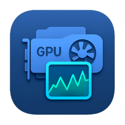
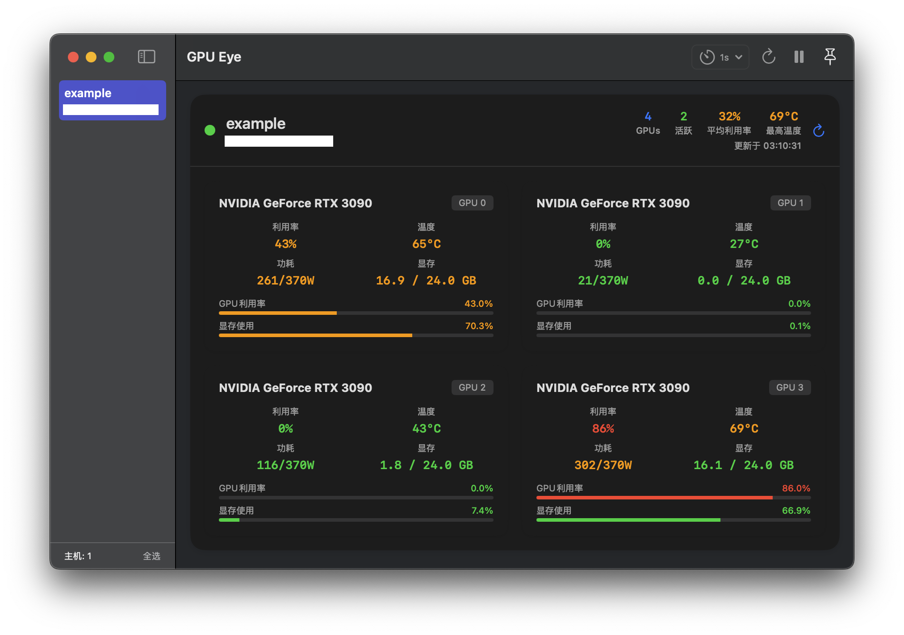

# GPUEye - AI开发的GPU监控应用

<div align="center">
  
</div>

> 中文文档 | [English](README.md)

GPUEye是一个由AI编写的macOS实用工具，用于远程GPU实时监控。
它通过SSH连接到远程GPU服务器，提供包括温度、利用率、内存使用和功耗在内的GPU状态实时监控。

## 应用截图

<div align="center">
  
</div>

## 功能特性

- **实时GPU监控** - 温度、利用率、内存和功耗
- **SSH连接管理** - 自动读取SSH配置文件以支持多主机
- **窗口置顶** - 保持应用程序窗口始终在最前面
- **可调刷新频率** - 支持1秒、3秒、5秒、10秒、30秒间隔
- **简约设计** - 专注于稳定性和可靠性

## 系统要求

- **macOS 14.0+**
- 目标GPU主机的**SSH访问权限**
- 目标主机上安装**nvidia-smi**工具

## 快速开始

### 1. SSH配置

确保您的SSH配置文件 `~/.ssh/config` 包含要监控的GPU主机：

```ssh
Host gpu-server-01
    HostName 192.168.1.100
    User admin
    Port 22

Host gpu-server-02
    HostName 192.168.1.101
    User root
    Port 22
```

### 2. 构建和运行

1. 在Xcode中打开 `GPUEye.xcodeproj`
2. 选择Mac作为目标平台
3. 构建并运行

或从命令行构建：
```bash
xcodebuild -project GPUEye.xcodeproj -scheme GPUEye -configuration Debug build
```

### 3. 使用方法

1. 启动应用程序 - 它会自动读取SSH配置
2. 从左侧边栏选择主机
3. 实时监控GPU信息
4. 使用工具栏控件调整刷新频率和窗口置顶

## 界面概览

### 左侧边栏
- 列出所有可用的SSH主机
- 点击选择要监控的主机
- "全选"按钮便于操作

### 主监控区域
- 显示已连接主机的GPU卡片
- 显示GPU名称、利用率、温度、功耗和内存使用情况

### 工具栏控件
- **⏱️ 刷新频率** - 选择监控频率(1秒-30秒)
- **🔄 手动刷新** - 立即更新所有主机数据
- **⏸️/▶️ 监控控制** - 暂停/恢复监控
- **📌 窗口置顶** - 切换始终在最前面(置顶时显示蓝色)

## 故障排除

### 连接失败
1. 检查SSH配置和网络连接
2. 确认SSH密钥认证设置正确
3. 使用主机卡片上的"重试"按钮

### 无GPU数据
1. 确认目标主机上已安装nvidia-smi
2. 检查用户执行nvidia-smi的权限
3. 确认主机确实有NVIDIA GPU设备

## 技术栈

- **Swift 5.0+** 与 **SwiftUI**
- **AppKit** 用于macOS特定功能
- **SSH** 用于远程连接
- **nvidia-smi** 用于GPU信息获取

## 项目结构

```
GPUEye/
├── GPUEyeApp.swift              # 应用程序入口点
├── ContentView.swift            # 主界面
├── GPUCardView.swift            # GPU信息卡片
├── HostCardView.swift           # 主机信息卡片
├── GPUMonitorService.swift      # 核心监控逻辑
├── SSHService.swift             # SSH连接服务
├── CoreModels.swift             # 数据模型
├── Assets.xcassets/             # 应用程序资源
├── GPUEye.entitlements         # 应用权限
├── GPUEye.xcodeproj/           # Xcode项目
└── README.md                   # 文档
```

## 许可证

**开源 - 免费使用**

本项目基于MIT许可证发布。您可以自由地：
- 使用、修改和分发此软件
- 将其包含在个人或商业项目中
- Fork并为项目做出贡献

## 贡献

欢迎贡献！随时Fork、提交Pull Request或建议改进。

---

*本项目由AI辅助开发。*